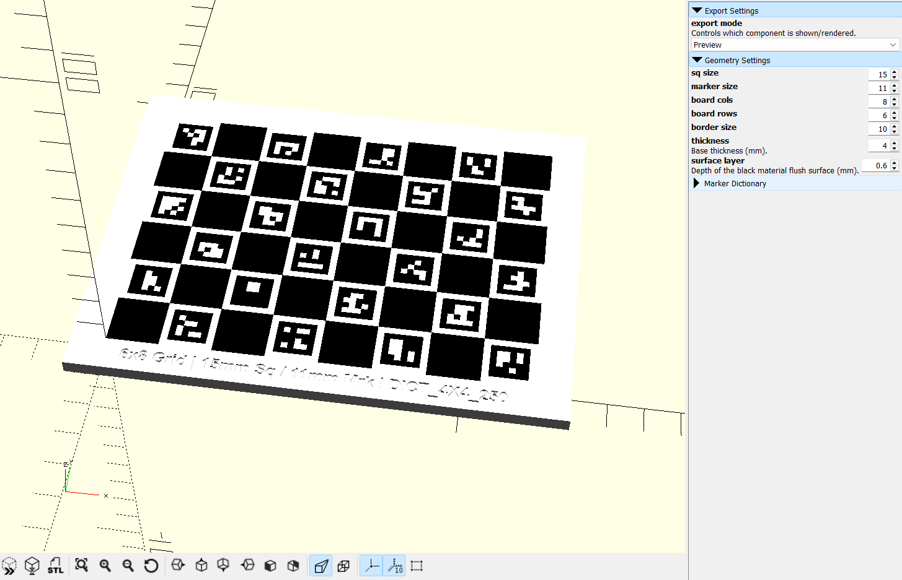
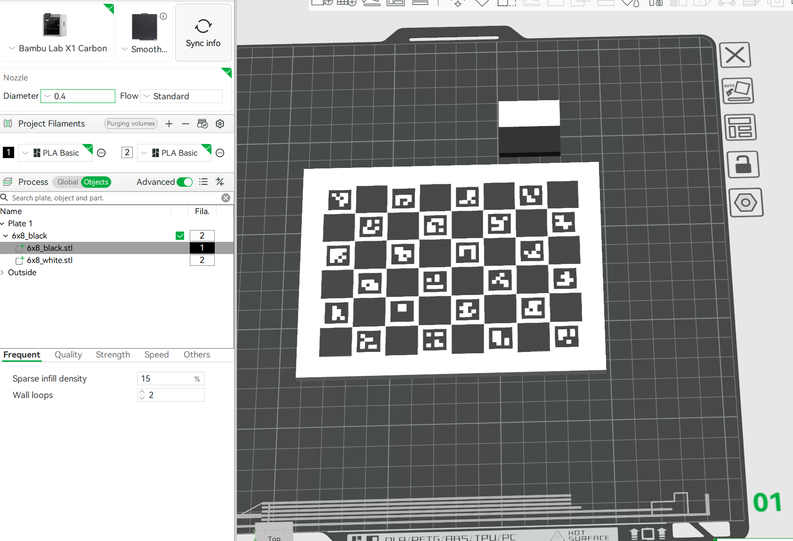
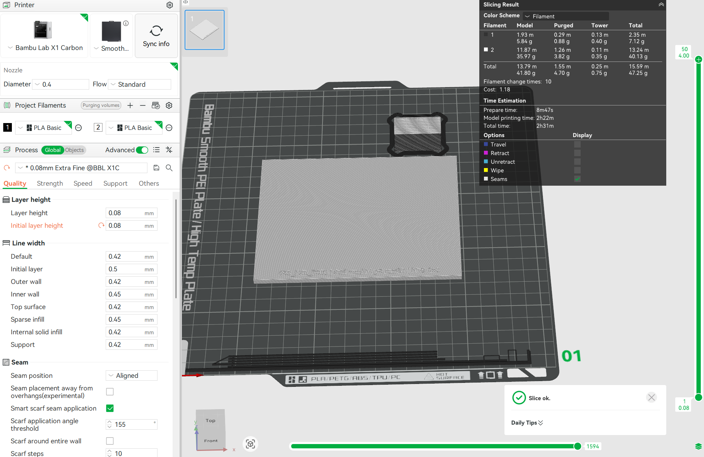

# Parametric 3D-Printable ChArUco Calibration Board


## What Changed In This Fork

This project was originally developed by **Robot Dolphins from Outer Space (Team 5199)** with **Gemini Pro**.

This repository is a fork that adapts the workflow for a lighter, smaller-scale, whole-board generation pipeline.


1. **Whole board generation only**
   - Removed printer bed split logic and part-index based tiling.
   - The model now generates one complete board.

2. **Independent row/column control**
   - Added direct control of `board_rows` and `board_cols`.


## Quick Start

### 1. Install Dependencies

- [OpenSCAD](https://openscad.org/)
- Python 3.9+ recommended
- OpenCV with ArUco module:

```bash
pip install opencv-python
```

### 2. Open The Board Generator In OpenSCAD

Open:

- `charuco_board_generator.scad`

### 3. Configure Geometry (Customizer)

Set the main parameters:

- `board_rows`
- `board_cols`
- `sq_size`
- `marker_size`
- `border_size`
- `thickness`
- `surface_layer`

Use `F5` for fast preview while tuning.

### 4. (Optional) Generate Another ArUco Library

Run `generate_markers_library.py` if you want a different ArUco dictionary than the default `DICT_4X4_250`.

### 5. Export STL Files

1. Set `export_mode = "White Base"`
2. Press `F6` (Render)
3. Export STL
4. Set `export_mode = "Black Pattern"`
5. Press `F6` again
6. Export STL




### 6. Slice As Multipart Model (Bambu studio)

1. Import both STL files into your slicer at the same time.
2. Choose "Yes" when "Load these files as a single object with multiple parts" appears.
3. Go to "Process" -> "Object" and assign white filament to the whole part, then assign black filament to the `_black.stl` sub-part.
4. Select the whole part and rotate it 180 degrees around the Y axis so the markers face down and the text label faces up.
5. Go to "Process" -> "Global", choose the proper resolution, layer height, and initial layer height, then slice and print.





## Pre-Generated Files

For convenience, this repo includes pre-generated files under:

- `stl/`
- `slicer/`

Use those directly if they match your printer and board requirements.

